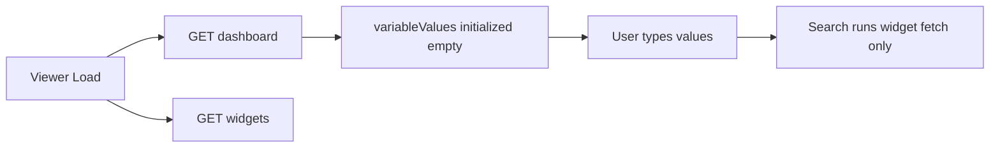
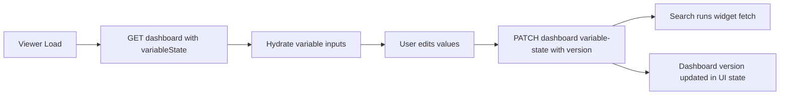

# Dashboard Variable Search Persistence Implementation Plan

> **For agentic workers:** REQUIRED SUB-SKILL: Use superpowers:subagent-driven-development (recommended) or superpowers:executing-plans to implement this plan task-by-task. Steps use checkbox (`- [ ]`) syntax for tracking.

**Goal:** Persist dashboard variable values from Search so the next dashboard load restores the last searched inputs from dashboard data.

**Architecture:** Extend dashboard persistence with a `variable_state_json` column and expose it via dashboard read/write APIs using optimistic version locking. In the viewer, hydrate variable inputs from server state and save current variables when Search runs, then execute widget requests with those values.

**Tech Stack:** Spring Boot 3.5, Java 21, SQLite, React 19, TypeScript 5, Vitest 4, React Testing Library

---

## Delivery Contract

- Audience: Engineering
- Output mode: Plan + artifact
- Artifact paths:
  - `docs/superpowers/plans/2026-06-19-dashboard-variable-search-persistence.md`
  - `docs/superpowers/plans/2026-06-19-dashboard-variable-search-persistence.html`

## Constraints Manifest

- Types and controls:
  - Persisted variable state is `Map<String, String>` serialized as JSON.
  - Viewer inputs remain `text` and `datetime-local` only.
- Validation:
  - Persist only variable names discovered from widget data sources.
  - Ignore unknown keys when hydrating UI.
  - Null/empty JSON must deserialize to `{}`.
- Security:
  - No code execution from persisted values.
  - Keep current token replacement behavior (plain string substitution).
  - Do not add support for secret or executable variable types.
- Compatibility:
  - Existing dashboards must continue to load with empty variable state.
  - Existing dashboard create/rename/duplicate/delete contracts remain unchanged.
  - Keep optimistic locking semantics (dashboard version must match on write).

## As-Is Diagram



## To-Be Diagram



## File Structure

- Create: `src/main/resources/db/migration/V2__add_dashboard_variable_state_json.sql`
- Modify: `src/main/java/com/dashboardplatform/dashboard/Dashboard.java`
- Modify: `src/main/java/com/dashboardplatform/dashboard/JdbcDashboardRepository.java`
- Modify: `src/main/java/com/dashboardplatform/dashboard/DashboardResponse.java`
- Modify: `src/main/java/com/dashboardplatform/dashboard/DashboardRequests.java`
- Modify: `src/main/java/com/dashboardplatform/dashboard/DashboardService.java`
- Modify: `src/main/java/com/dashboardplatform/dashboard/DashboardController.java`
- Modify: `src/test/java/com/dashboardplatform/dashboard/JdbcDashboardRepositoryTest.java`
- Modify: `src/test/java/com/dashboardplatform/dashboard/DashboardServiceTest.java`
- Modify: `src/test/java/com/dashboardplatform/dashboard/DashboardControllerTest.java`
- Modify: `src/main/frontend/src/dashboard/types.ts`
- Modify: `src/main/frontend/src/dashboard/dashboardApi.ts`
- Modify: `src/main/frontend/src/widget/DashboardViewer.tsx`
- Modify: `src/main/frontend/src/widget/__tests__/DashboardViewer.test.tsx`

## Task 1: Persist Variable State In Dashboard Storage

**Files:**
- Create: `src/main/resources/db/migration/V2__add_dashboard_variable_state_json.sql`
- Modify: `src/main/java/com/dashboardplatform/dashboard/Dashboard.java`
- Modify: `src/main/java/com/dashboardplatform/dashboard/JdbcDashboardRepository.java`
- Test: `src/test/java/com/dashboardplatform/dashboard/JdbcDashboardRepositoryTest.java`

- [ ] **Step 1: Write failing repository test for variable state round-trip**

Add test in `JdbcDashboardRepositoryTest.java`:

```java
@Test
void insertAndFindByIdPreservesVariableStateJson() {
    var repository = createRepository(tempDir.resolve("variable-state.db"));
    var dashboard = dashboard(
        UUID.fromString("11111111-1111-1111-1111-111111111111"),
        "Service Operations",
        "Incidents and platform health",
        "[]",
        "{\"region\":\"us-east-1\",\"from\":\"2026-06-19T09:30\"}",
        1L,
        Instant.parse("2026-06-15T09:00:00Z"),
        Instant.parse("2026-06-15T09:00:00Z"));

    repository.insert(dashboard);

    var stored = repository.findById(dashboard.id());
    assertTrue(stored.isPresent());
    assertEquals(dashboard.variableStateJson(), stored.orElseThrow().variableStateJson());
}
```

- [ ] **Step 2: Run the failing backend test**

Run:

```bash
./mvnw test -Dtest=JdbcDashboardRepositoryTest
```

Expected: FAIL because schema/model/repository do not include `variable_state_json`.

- [ ] **Step 3: Add migration for dashboard variable state**

Create `V2__add_dashboard_variable_state_json.sql`:

```sql
ALTER TABLE dashboards
ADD COLUMN variable_state_json TEXT NOT NULL DEFAULT '{}';
```

- [ ] **Step 4: Add model and repository support**

Update `Dashboard.java` record:

```java
public record Dashboard(
    UUID id,
    String name,
    String description,
    String widgetsJson,
    String variableStateJson,
    long version,
    Instant createdAt,
    Instant updatedAt
) {
}
```

Update SQL in `JdbcDashboardRepository.java` (`findAll`, `findById`, `insert`, `update`, row mapper):

```java
SELECT id, name, description, widgets_json, variable_state_json, version, created_at, updated_at
FROM dashboards
```

```java
INSERT INTO dashboards (
    id, name, description, widgets_json, variable_state_json, version, created_at, updated_at
) VALUES (?, ?, ?, ?, ?, ?, ?, ?)
```

```java
UPDATE dashboards
SET name = ?, description = ?, widgets_json = ?, variable_state_json = ?, version = ?, updated_at = ?
WHERE id = ? AND version = ?
```

```java
resultSet.getString("variable_state_json")
```

- [ ] **Step 5: Run repository tests and commit**

Run:

```bash
./mvnw test -Dtest=JdbcDashboardRepositoryTest
```

Expected: PASS.

Commit:

```bash
git add src/main/resources/db/migration/V2__add_dashboard_variable_state_json.sql src/main/java/com/dashboardplatform/dashboard/Dashboard.java src/main/java/com/dashboardplatform/dashboard/JdbcDashboardRepository.java src/test/java/com/dashboardplatform/dashboard/JdbcDashboardRepositoryTest.java
git commit -m "feat: persist dashboard variable state json"
```

## Task 2: Add Dashboard API Contract For Variable State

**Files:**
- Modify: `src/main/java/com/dashboardplatform/dashboard/DashboardRequests.java`
- Modify: `src/main/java/com/dashboardplatform/dashboard/DashboardService.java`
- Modify: `src/main/java/com/dashboardplatform/dashboard/DashboardResponse.java`
- Modify: `src/main/java/com/dashboardplatform/dashboard/DashboardController.java`
- Test: `src/test/java/com/dashboardplatform/dashboard/DashboardServiceTest.java`
- Test: `src/test/java/com/dashboardplatform/dashboard/DashboardControllerTest.java`

- [ ] **Step 1: Write failing service and controller tests**

Add service test in `DashboardServiceTest.java`:

```java
@Test
void updateVariableStatePersistsJsonAndIncrementsVersion() {
    var repository = new InMemoryDashboardRepository();
    var stored = dashboard(
        UUID.fromString("11111111-1111-1111-1111-111111111111"),
        "Service Operations",
        "Incidents and platform health",
        "[]",
        "{}",
        3L,
        Instant.parse("2026-06-15T10:00:00Z"),
        Instant.parse("2026-06-15T11:00:00Z"));
    repository.insert(stored);
    var service = new DashboardService(repository, CLOCK, uuidSequence(
        UUID.fromString("22222222-2222-2222-2222-222222222222")));

    var updated = service.updateVariableState(
        stored.id(),
        stored.version(),
        Map.of("region", "us-east-1", "from", "2026-06-19T09:30"));

    assertEquals("{\"from\":\"2026-06-19T09:30\",\"region\":\"us-east-1\"}", updated.variableStateJson());
    assertEquals(4L, updated.version());
}
```

Add controller test in `DashboardControllerTest.java`:

```java
@Test
void patchDashboardVariableStateReturnsUpdatedDashboard() throws Exception {
    var id = UUID.fromString("11111111-1111-1111-1111-111111111111");
    var updated = dashboard(
        id,
        "Operations",
        "Platform health",
        "[]",
        "{\"userId\":\"42\"}",
        5L,
        Instant.parse("2026-06-15T09:30:00Z"),
        Instant.parse("2026-06-15T12:30:00Z"));
    given(dashboardService.updateVariableState(id, 4L, Map.of("userId", "42"))).willReturn(updated);

    mockMvc.perform(patch("/api/dashboards/{id}/variable-state", id)
            .contentType(APPLICATION_JSON)
            .content("""
                {
                  "version": 4,
                  "variableState": {"userId": "42"}
                }
                """))
        .andExpect(status().isOk())
        .andExpect(jsonPath("$.variableState.userId").value("42"))
        .andExpect(jsonPath("$.version").value(5));
}
```

- [ ] **Step 2: Run failing backend tests**

Run:

```bash
./mvnw test -Dtest=DashboardServiceTest,DashboardControllerTest
```

Expected: FAIL because request/service/response/controller are missing variable-state support.

- [ ] **Step 3: Implement backend variable-state API**

Update request contract in `DashboardRequests.java`:

```java
record UpdateDashboardVariableStateRequest(
    @Positive long version,
    java.util.Map<String, String> variableState
) {
}
```

Update `DashboardService.java` with method:

```java
public Dashboard updateVariableState(UUID id, long expectedVersion, Map<String, String> variableState) {
    var existing = repository.findById(id).orElseThrow(() -> new DashboardNotFoundException(id));
    var next = new Dashboard(
        existing.id(),
        existing.name(),
        existing.description(),
        existing.widgetsJson(),
        toStableJson(variableState == null ? Map.of() : variableState),
        existing.version() + 1,
        existing.createdAt(),
        Instant.now(clock));
    if (!repository.update(next, expectedVersion)) {
        throw conflict(id);
    }
    return next;
}
```

Update `DashboardResponse.java` to include parsed map:

```java
Map<String, String> variableState,
```

and parse helper:

```java
private static Map<String, String> parseVariableState(String json, ObjectMapper objectMapper) {
    if (json == null || json.isBlank()) {
        return Map.of();
    }
    try {
        return objectMapper.readValue(json, new TypeReference<Map<String, String>>() {});
    } catch (java.io.IOException exception) {
        throw new UncheckedIOException("Failed to parse stored dashboard variable state", exception);
    }
}
```

Update `DashboardController.java`:

```java
@PatchMapping("/{id}/variable-state")
public DashboardResponse updateVariableState(
    @PathVariable UUID id,
    @Valid @RequestBody UpdateDashboardVariableStateRequest request
) {
    return response(dashboardService.updateVariableState(id, request.version(), request.variableState()));
}
```

- [ ] **Step 4: Run backend tests and commit**

Run:

```bash
./mvnw test -Dtest=DashboardServiceTest,DashboardControllerTest,JdbcDashboardRepositoryTest
```

Expected: PASS.

Commit:

```bash
git add src/main/java/com/dashboardplatform/dashboard/DashboardRequests.java src/main/java/com/dashboardplatform/dashboard/DashboardService.java src/main/java/com/dashboardplatform/dashboard/DashboardResponse.java src/main/java/com/dashboardplatform/dashboard/DashboardController.java src/test/java/com/dashboardplatform/dashboard/DashboardServiceTest.java src/test/java/com/dashboardplatform/dashboard/DashboardControllerTest.java
git commit -m "feat: add dashboard variable state API"
```

## Task 3: Hydrate And Save Variable State In Viewer

**Files:**
- Modify: `src/main/frontend/src/dashboard/types.ts`
- Modify: `src/main/frontend/src/dashboard/dashboardApi.ts`
- Modify: `src/main/frontend/src/widget/DashboardViewer.tsx`
- Modify: `src/main/frontend/src/widget/__tests__/DashboardViewer.test.tsx`

- [ ] **Step 1: Write failing frontend tests for persistence behavior**

Add tests in `DashboardViewer.test.tsx`:

```typescript
it("hydrates variable inputs from dashboard variableState", async () => {
  const variableWidget = {
    ...latencyWidget,
    dataSource: {
      ...latencyWidget.dataSource,
      url: "https://api.example.test/latency/{{userId}}"
    }
  };
  fetchMock.mockResolvedValueOnce(jsonResponse({ ...dashboard, variableState: { userId: "42" } }));
  fetchMock.mockResolvedValueOnce(jsonResponse([variableWidget]));

  renderViewer();

  const input = await screen.findByLabelText("userId variable");
  expect(input).toHaveValue("42");
});

it("saves variableState before running search requests", async () => {
  const user = userEvent.setup();
  const variableWidget = {
    ...latencyWidget,
    dataSource: {
      ...latencyWidget.dataSource,
      url: "https://api.example.test/latency/{{userId}}"
    }
  };
  fetchMock.mockResolvedValueOnce(jsonResponse({ ...dashboard, variableState: {} }));
  fetchMock.mockResolvedValueOnce(jsonResponse([variableWidget]));
  fetchMock.mockResolvedValueOnce(jsonResponse({ ...dashboard, variableState: { userId: "42" }, version: 5 }));
  fetchMock.mockResolvedValueOnce(jsonResponse({ value: "123.0" }));

  renderViewer();

  await screen.findByRole("heading", { name: "Latency" });
  await user.type(screen.getByLabelText("userId variable"), "42");
  await user.click(screen.getByRole("button", { name: "Search" }));

  expect(fetchMock).toHaveBeenNthCalledWith(
    3,
    "/api/dashboards/dashboard-1/variable-state",
    expect.objectContaining({
      method: "PATCH",
      body: JSON.stringify({ version: 4, variableState: { userId: "42" } })
    })
  );
});
```

- [ ] **Step 2: Run failing frontend test**

Run:

```bash
npm --prefix src/main/frontend run test:run -- src/widget/__tests__/DashboardViewer.test.tsx
```

Expected: FAIL because dashboard types/API/viewer do not support persisted variable state.

- [ ] **Step 3: Implement frontend save + hydrate flow**

Update dashboard type in `types.ts`:

```typescript
export type Dashboard = {
  id: string;
  name: string;
  description: string;
  widgets: Array<Record<string, unknown>>;
  variableState?: Record<string, string>;
  version: number;
  createdAt?: string;
  updatedAt?: string;
};
```

Update API helper in `dashboardApi.ts`:

```typescript
export async function updateDashboardVariableState(
  id: string,
  input: { version: number; variableState: Record<string, string> }
): Promise<Dashboard> {
  return request<Dashboard>(`/api/dashboards/${id}/variable-state`, jsonRequest("PATCH", input));
}
```

Update viewer flow in `DashboardViewer.tsx`:

```typescript
useEffect(() => {
  const allowed = new Set(variables.map((v) => v.name));
  const persisted = dashboard?.variableState ?? {};
  setVariableValues(
    Object.fromEntries(Object.entries(persisted).filter(([key]) => allowed.has(key)))
  );
}, [dashboard?.id, dashboard?.version, variables]);
```

```typescript
const persisted = await updateDashboardVariableState(id, {
  version: dashboard.version,
  variableState: Object.fromEntries(
    Object.entries(variableValues).filter(([key]) => variables.some((v) => v.name === key))
  )
});
setDashboard(persisted);
```

Call persistence at the beginning of `runRequests` before widget fetches.

- [ ] **Step 4: Run frontend tests and commit**

Run:

```bash
npm --prefix src/main/frontend run test:run -- src/widget/__tests__/DashboardViewer.test.tsx
npm --prefix src/main/frontend run test:run -- src/widget/__tests__/widgetRequestRunner.test.ts
```

Expected: PASS.

Commit:

```bash
git add src/main/frontend/src/dashboard/types.ts src/main/frontend/src/dashboard/dashboardApi.ts src/main/frontend/src/widget/DashboardViewer.tsx src/main/frontend/src/widget/__tests__/DashboardViewer.test.tsx
git commit -m "feat: persist viewer variable search state"
```

## Acceptance Criteria

- Dashboard variable inputs are prefilled from server-persisted `variableState` when viewer opens.
- Clicking Search persists current variable values to dashboard data before widget requests run.
- Refresh uses the same in-memory variable values used by the latest Search.
- Unknown variable keys in stored state do not render inputs and are ignored.
- Version conflicts on variable-state save surface a user-visible error and do not crash the page.
- Existing dashboards without `variable_state_json` still load and behave normally.

## Risks And Rollout

- Risk: additional PATCH call on each Search increases latency.
  - Mitigation: save once per Search, not per keystroke.
- Risk: version conflicts if editor and viewer are open simultaneously.
  - Mitigation: show conflict notice and prompt reload using existing conflict messaging style.
- Risk: stale variable keys after widget config changes.
  - Mitigation: filter persisted keys against extracted variables before hydrate.

Rollout plan:
- Ship behind normal release process (no feature flag needed).
- Run full backend + frontend test suites before merge.
- Verify manually on one existing dashboard created before migration.

## Self-Review

- Spec coverage: includes persistence in dashboard data, restore of old search values, and viewer integration.
- Placeholder scan: no TODO/TBD placeholders.
- Type consistency: `variableState` uses `Map<String, String>` backend and `Record<string, string>` frontend throughout.

## Execution Handoff

Plan complete and saved to `docs/superpowers/plans/2026-06-19-dashboard-variable-search-persistence.md`. Two execution options:

1. Subagent-Driven (recommended) - I dispatch a fresh subagent per task, review between tasks, fast iteration
2. Inline Execution - Execute tasks in this session using executing-plans, batch execution with checkpoints

Which approach?
