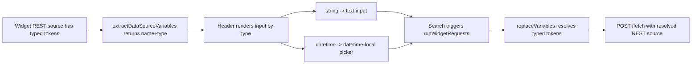

# REST Variable Types In Caveman Header Implementation Plan

> **For agentic workers:** REQUIRED SUB-SKILL: Use superpowers:subagent-driven-development (recommended) or superpowers:executing-plans to implement this plan task-by-task. Steps use checkbox (`- [ ]`) syntax for tracking.

**Goal:** Support only `string` and `datetime` dashboard variables for REST data sources in viewer mode, and render `datetime` variables with a datetime picker in the header.

**Architecture:** Keep variable discovery and substitution in `widgetRequestRunner.ts`, but extend parsing to produce variable descriptors with explicit type metadata. `DashboardViewer.tsx` consumes descriptors to render type-correct inputs (`text` for `string`, `datetime-local` for `datetime`) while preserving current Search/Refresh behavior.

**Tech Stack:** React 19, TypeScript 5, Vitest 4, React Testing Library.

---

## As-Is Diagram

```mermaid
flowchart LR
  A[Widget REST source has {{var}} tokens] --> B[DashboardViewer extracts variable names]
  B --> C[Header renders plain text inputs]
  C --> D[Search triggers runWidgetRequests]
  D --> E[replaceVariables injects string values]
  E --> F[POST /fetch with resolved REST source]
```

## To-Be Diagram



## Constraints Manifest

- Allowed variable types are exactly `string` and `datetime`.
- `datetime` input must render as a datetime picker (`input[type="datetime-local"]`).
- Existing untyped tokens remain supported and default to `string`.
- Existing dashboards and widgets without variable tokens must behave unchanged.
- Do not alter backend contracts; all changes remain frontend-side.

## File Structure

- Modify: `src/main/frontend/src/widget/types.ts`
- Modify: `src/main/frontend/src/widget/widgetRequestRunner.ts`
- Modify: `src/main/frontend/src/widget/DashboardViewer.tsx`
- Modify: `src/main/frontend/src/widget/__tests__/widgetRequestRunner.test.ts`
- Modify: `src/main/frontend/src/widget/__tests__/DashboardViewer.test.tsx`

## Token Format Decision

- Canonical typed token: `{{variableName:datetime}}` or `{{variableName:string}}`
- Backward-compatible token: `{{variableName}}` (implicitly `string`)
- Invalid type fallback: treated as `string` and covered by test

## Task 1: Add Typed Variable Descriptor Model

**Files:**
- Modify: `src/main/frontend/src/widget/types.ts`
- Modify: `src/main/frontend/src/widget/widgetRequestRunner.ts`
- Test: `src/main/frontend/src/widget/__tests__/widgetRequestRunner.test.ts`

- [ ] **Step 1: Add variable type definitions in `types.ts`**

```ts
export type VariableType = "string" | "datetime";

export interface DataSourceVariable {
  name: string;
  type: VariableType;
}
```

- [ ] **Step 2: Replace name-only extractor with typed extractor**

```ts
export function extractDataSourceVariables(widgets: Widget[]): DataSourceVariable[] {
  const byName = new Map<string, DataSourceVariable>();
  // parse tokens from url, headers, body and keep first-seen type
  return Array.from(byName.values()).sort((a, b) => a.name.localeCompare(b.name));
}
```

- [ ] **Step 3: Extend variable parser to support type suffix**

```ts
// supports {{name}} and {{name:datetime}} / {{name:string}}
const TOKEN = /{{\s*([A-Za-z0-9_.-]+)(?::(string|datetime))?\s*}}/g;
```

- [ ] **Step 4: Update replacement logic to ignore type suffix in output**

```ts
function replaceVariables(value: string, variables: Record<string, string>): string {
  return value.replace(TOKEN, (_m, name: string) => variables[name] ?? "");
}
```

- [ ] **Step 5: Add unit tests for typed token parsing and replacement**

```ts
it("extracts datetime variable type from typed token", () => {
  // {{from:datetime}} => { name: "from", type: "datetime" }
});

it("defaults untyped token to string", () => {
  // {{region}} => { name: "region", type: "string" }
});
```

- [ ] **Step 6: Run focused tests**

Run: `cd src/main/frontend && npm.cmd run test:run -- src/widget/__tests__/widgetRequestRunner.test.ts`
Expected: PASS

- [ ] **Step 7: Commit**

```bash
git add src/main/frontend/src/widget/types.ts \
  src/main/frontend/src/widget/widgetRequestRunner.ts \
  src/main/frontend/src/widget/__tests__/widgetRequestRunner.test.ts
git commit -m "feat(widget): support typed datasource variables"
```

## Task 2: Render Datetime Variables With Datetime Picker In Header

**Files:**
- Modify: `src/main/frontend/src/widget/DashboardViewer.tsx`
- Test: `src/main/frontend/src/widget/__tests__/DashboardViewer.test.tsx`

- [ ] **Step 1: Switch viewer from variable names to typed variable descriptors**

```ts
const variables = useMemo(() => extractDataSourceVariables(widgets), [widgets]);
```

- [ ] **Step 2: Render type-specific input control**

```tsx
<input
  type={variable.type === "datetime" ? "datetime-local" : "text"}
  aria-label={`${variable.name} variable`}
  value={variableValues[variable.name] ?? ""}
  onChange={(event) =>
    setVariableValues((current) => ({ ...current, [variable.name]: event.target.value }))
  }
/>
```

- [ ] **Step 3: Add viewer tests for control type behavior**

```ts
it("renders datetime variables as datetime-local picker", async () => {
  // variable token includes :datetime
  // expect input type datetime-local
});

it("renders string variables as text input", async () => {
  // variable token includes :string or no type
  // expect input type text
});
```

- [ ] **Step 4: Keep existing Search/Refresh behavior unchanged**

Run: `cd src/main/frontend && npm.cmd run test:run -- src/widget/__tests__/DashboardViewer.test.tsx`
Expected: PASS with no regressions in existing search/refresh tests

- [ ] **Step 5: Commit**

```bash
git add src/main/frontend/src/widget/DashboardViewer.tsx \
  src/main/frontend/src/widget/__tests__/DashboardViewer.test.tsx
git commit -m "feat(viewer): render datetime variable picker in header"
```

## Task 3: End-to-End Regression Sweep (Frontend)

**Files:**
- Modify (if needed): `src/main/frontend/src/widget/__tests__/widgetRequestRunner.test.ts`
- Modify (if needed): `src/main/frontend/src/widget/__tests__/DashboardViewer.test.tsx`

- [ ] **Step 1: Add mixed-token coverage**

```ts
// Example source
url: ".../events?region={{region}}&from={{from:datetime}}"
headers: { "X-From": "{{from:datetime}}" }
```

- [ ] **Step 2: Verify final resolved payload contains raw values without type suffixes**

```ts
expect(payload.url).toContain("from=2026-06-19T09:30");
expect(payload.headers["X-From"]).toBe("2026-06-19T09:30");
```

- [ ] **Step 3: Run full frontend test suite**

Run: `cd src/main/frontend && npm.cmd run test:run`
Expected: PASS

- [ ] **Step 4: Build frontend bundle**

Run: `cd src/main/frontend && npm.cmd run build`
Expected: `vite build` succeeds

- [ ] **Step 5: Commit**

```bash
git add src/main/frontend/src/widget/__tests__/widgetRequestRunner.test.ts \
  src/main/frontend/src/widget/__tests__/DashboardViewer.test.tsx
git commit -m "test(widget): cover typed variable rendering and substitution"
```

## Acceptance Criteria

- Viewer supports only `string` and `datetime` variable types.
- `datetime` variables render with `input[type="datetime-local"]` in dashboard header.
- `string` variables render with text input.
- Token replacement still resolves values into URL/header/body before fetch.
- Untyped tokens (`{{name}}`) continue to work as `string`.
- Search and Refresh interaction remains unchanged.
- Frontend tests and build pass.

## Risks and Mitigations

- Risk: Existing token parser behavior regression.
  Mitigation: Keep backward-compatible token format and add parser regression tests.
- Risk: Browser differences for datetime-local UX.
  Mitigation: Use native control, test behavior via value payload and not strict UI rendering details.
- Risk: Ambiguous types when same variable name appears with different suffixes.
  Mitigation: Document first-seen-wins rule and add test coverage for deterministic behavior.

## Rollout

- Release behind existing viewer workflow (no feature flag required if backward compatible).
- Monitor viewer error notices and REST fetch failure rates in staging after deploy.
- If regressions appear, revert to previous extractor and retain typed parser tests for fast reapply.

## Self-Review Checklist

- Spec coverage: includes variable typing constraints and datetime picker requirement.
- Placeholder scan: no TODO/TBD placeholders.
- Type consistency: uses `string | datetime` across parser, viewer, and tests.
