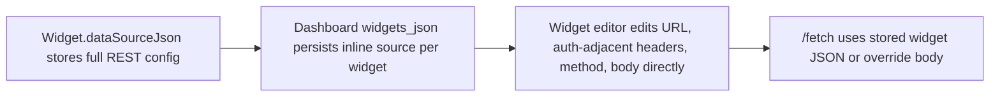
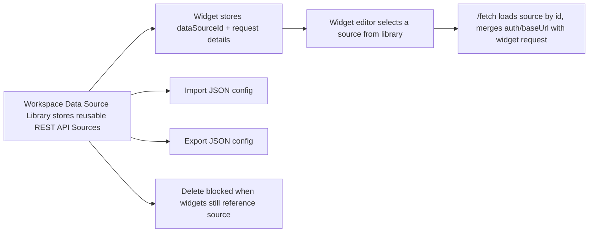

# Manage Data Sources Implementation Plan

> **For agentic workers:** REQUIRED SUB-SKILL: Use superpowers:subagent-driven-development (recommended) or superpowers:executing-plans to implement this plan task-by-task. Steps use checkbox (`- [ ]`) syntax for tracking.

**Goal:** Add a workspace-level REST API Source library with JSON import/export, then update widgets so they choose a source from that library instead of storing full source configuration inline.

**Architecture:** Introduce a new `data_sources` workspace table and a backend `datasource` slice for CRUD, import/export, and reference checks. Change widget source persistence from inline REST source config to a `dataSourceId` plus widget-owned request details, then update the frontend so the workspace sidebar exposes a Data Source Library and widget editing uses source selection plus per-widget request fields.

**Tech Stack:** Spring Boot 3.5.7, Java 21, SQLite, React 19, TypeScript 5, Vite 8, Vitest 4, React Testing Library.

---

## As-Is Diagram



## To-Be Diagram



## Constraints Manifest

- Use `Workspace`, `Data Source`, `Data Source Library`, and `REST API Source` naming from [CONTEXT.md](/D:/AI/dashboard-platform/CONTEXT.md).
- Keep backend tests package-private and avoid `@SpringBootTest`.
- Add new database migrations only; never edit existing files in `src/main/resources/db/migration/`.
- Preserve optimistic version locking for widget mutations.
- Version 1 of the new library supports only REST API Sources.
- Widget request variable tokens remain widget-owned and must live only in path, headers, query values, and JSON body text, not in source credentials.
- Deleting a data source referenced by any widget must fail and return the dependent dashboards/widgets.
- Existing dashboards with inline REST source config need a compatibility path during rollout; do not require a destructive one-shot migration.

## File Structure

- Create: `src/main/resources/db/migration/V3__create_data_sources.sql`
- Create: `src/main/java/com/dashboardplatform/datasource/DataSource.java`
- Create: `src/main/java/com/dashboardplatform/datasource/DataSourceRepository.java`
- Create: `src/main/java/com/dashboardplatform/datasource/JdbcDataSourceRepository.java`
- Create: `src/main/java/com/dashboardplatform/datasource/DataSourceService.java`
- Create: `src/main/java/com/dashboardplatform/datasource/DataSourceController.java`
- Create: `src/main/java/com/dashboardplatform/datasource/DataSourceRequests.java`
- Create: `src/main/java/com/dashboardplatform/datasource/DataSourceResponse.java`
- Create: `src/main/java/com/dashboardplatform/datasource/DataSourceExceptions.java`
- Modify: `src/main/java/com/dashboardplatform/widget/Widget.java`
- Modify: `src/main/java/com/dashboardplatform/widget/WidgetRequests.java`
- Modify: `src/main/java/com/dashboardplatform/widget/WidgetResponse.java`
- Modify: `src/main/java/com/dashboardplatform/widget/WidgetService.java`
- Modify: `src/main/java/com/dashboardplatform/widget/JdbcWidgetRepository.java`
- Create: `src/test/java/com/dashboardplatform/datasource/JdbcDataSourceRepositoryTest.java`
- Create: `src/test/java/com/dashboardplatform/datasource/DataSourceServiceTest.java`
- Create: `src/test/java/com/dashboardplatform/datasource/DataSourceControllerTest.java`
- Modify: `src/test/java/com/dashboardplatform/widget/WidgetResponseTest.java`
- Modify: `src/test/java/com/dashboardplatform/dashboard/JdbcDashboardRepositoryTest.java`
- Create: `src/main/frontend/src/data-source/types.ts`
- Create: `src/main/frontend/src/data-source/dataSourceApi.ts`
- Create: `src/main/frontend/src/data-source/DataSourceLibrary.tsx`
- Create: `src/main/frontend/src/data-source/DataSourceDialog.tsx`
- Create: `src/main/frontend/src/data-source/DeleteDataSourceDialog.tsx`
- Create: `src/main/frontend/src/data-source/__tests__/dataSourceApi.test.ts`
- Create: `src/main/frontend/src/data-source/__tests__/DataSourceLibrary.test.tsx`
- Modify: `src/main/frontend/src/App.tsx`
- Modify: `src/main/frontend/src/dashboard/AppSidebar.tsx`
- Modify: `src/main/frontend/src/widget/types.ts`
- Modify: `src/main/frontend/src/widget/widgetApi.ts`
- Modify: `src/main/frontend/src/widget/widgetRequestRunner.ts`
- Modify: `src/main/frontend/src/widget/WidgetDataSourceForm.tsx`
- Modify: `src/main/frontend/src/widget/WidgetEditPanel.tsx`
- Modify: `src/main/frontend/src/widget/DashboardEditor.tsx`
- Modify: `src/main/frontend/src/widget/DashboardViewer.tsx`
- Modify: `src/main/frontend/src/widget/__tests__/DashboardEditor.test.tsx`
- Modify: `src/main/frontend/src/widget/__tests__/widgetApi.test.ts`
- Modify: `src/main/frontend/src/widget/__tests__/widgetRequestRunner.test.ts`

## Contract Decisions

- New workspace resource:
  - `GET /api/data-sources`
  - `POST /api/data-sources`
  - `PATCH /api/data-sources/{id}`
  - `DELETE /api/data-sources/{id}?version=...`
  - `POST /api/data-sources/import`
  - `GET /api/data-sources/{id}/export`
- Widget persistence shape becomes:

```json
{
  "kind": "rest",
  "dataSourceId": "11111111-1111-1111-1111-111111111111",
  "request": {
    "path": "/orders",
    "method": "GET",
    "headers": {
      "X-Region": "{{region}}"
    },
    "body": null
  }
}
```

- Data source export/import JSON becomes:

```json
{
  "name": "Orders API",
  "type": "rest",
  "config": {
    "baseUrl": "https://api.example.test",
    "authentication": {
      "type": "api_key_header",
      "headerName": "X-API-Key",
      "value": "secret"
    }
  }
}
```

- Compatibility rule for existing widgets:
  - If `dataSourceJson` still contains legacy inline REST fields (`url`, `headers`, `method`, `body` without `dataSourceId`), keep reading it and allow test fetch.
  - Editing and saving that widget in the new UI must require choosing a workspace data source before save succeeds.

## Task 1: Create Backend Data Source Library Slice

**Files:**
- Create: `src/main/resources/db/migration/V3__create_data_sources.sql`
- Create: `src/main/java/com/dashboardplatform/datasource/DataSource.java`
- Create: `src/main/java/com/dashboardplatform/datasource/DataSourceRepository.java`
- Create: `src/main/java/com/dashboardplatform/datasource/JdbcDataSourceRepository.java`
- Create: `src/main/java/com/dashboardplatform/datasource/DataSourceService.java`
- Create: `src/main/java/com/dashboardplatform/datasource/DataSourceController.java`
- Create: `src/main/java/com/dashboardplatform/datasource/DataSourceRequests.java`
- Create: `src/main/java/com/dashboardplatform/datasource/DataSourceResponse.java`
- Create: `src/main/java/com/dashboardplatform/datasource/DataSourceExceptions.java`
- Create: `src/test/java/com/dashboardplatform/datasource/JdbcDataSourceRepositoryTest.java`
- Create: `src/test/java/com/dashboardplatform/datasource/DataSourceServiceTest.java`
- Create: `src/test/java/com/dashboardplatform/datasource/DataSourceControllerTest.java`

- [ ] **Step 1: Write the repository persistence test first**

```java
@Test
void insert_and_find_all_preserve_rest_source_config_json() {
    var repository = createRepository(tempDir.resolve("data-sources.db"));
    var source = new DataSource(
        UUID.fromString("11111111-1111-1111-1111-111111111111"),
        "Orders API",
        "rest",
        """
            {"baseUrl":"https://api.example.test","authentication":{"type":"none"}}
            """,
        1L,
        Instant.parse("2026-06-20T09:00:00Z"),
        Instant.parse("2026-06-20T09:00:00Z"));

    repository.insert(source);

    assertEquals(List.of(source), repository.findAll());
}
```

- [ ] **Step 2: Add the migration**

```sql
CREATE TABLE data_sources (
    id TEXT PRIMARY KEY,
    name TEXT NOT NULL,
    type TEXT NOT NULL,
    config_json TEXT NOT NULL,
    version INTEGER NOT NULL,
    created_at TEXT NOT NULL,
    updated_at TEXT NOT NULL
);

CREATE INDEX idx_data_sources_updated_at ON data_sources(updated_at DESC);
```

- [ ] **Step 3: Add the record and repository contract**

```java
public record DataSource(
    UUID id,
    String name,
    String type,
    String configJson,
    long version,
    Instant createdAt,
    Instant updatedAt
) {
}
```

```java
interface DataSourceRepository {
    List<DataSource> findAll();
    Optional<DataSource> findById(UUID id);
    void insert(DataSource dataSource);
    boolean update(DataSource dataSource, long expectedVersion);
    boolean delete(UUID id, long expectedVersion);
    boolean existsById(UUID id);
}
```

- [ ] **Step 4: Add repository implementation with optimistic update/delete**

```java
int updated = jdbcTemplate.update("""
    UPDATE data_sources
    SET name = ?, type = ?, config_json = ?, version = ?, updated_at = ?
    WHERE id = ? AND version = ?
    """,
    dataSource.name(),
    dataSource.type(),
    dataSource.configJson(),
    dataSource.version(),
    dataSource.updatedAt().toString(),
    dataSource.id().toString(),
    expectedVersion);
```

- [ ] **Step 5: Write service tests for create, import, export, and delete reference blocking**

```java
@Test
void delete_data_source_rejects_when_widgets_reference_it() {
    var references = List.of(new DataSourceReference(
        UUID.fromString("aaaaaaaa-aaaa-aaaa-aaaa-aaaaaaaaaaaa"),
        "Service Operations",
        UUID.fromString("bbbbbbbb-bbbb-bbbb-bbbb-bbbbbbbbbbbb"),
        "Latency"));

    var ex = assertThrows(
        DataSourceInUseException.class,
        () -> service.deleteDataSource(sourceId, 3L));

    assertEquals(references, ex.references());
}
```

- [ ] **Step 6: Implement service validation and import/export contract**

```java
record RestSourceConfig(String baseUrl, Authentication authentication) {
}

record Authentication(String type, String headerName, String value) {
}
```

```java
public DataSource exportDataSource(UUID id) {
    return repository.findById(id).orElseThrow(() -> new DataSourceNotFoundException(id));
}

public DataSource importDataSource(String name, String type, String configJson) {
    validate(name, type, configJson);
    return createDataSource(name, type, configJson);
}
```

- [ ] **Step 7: Add controller endpoints and stable error handling**

```java
@PostMapping("/import")
public ResponseEntity<DataSourceResponse> importDataSource(
    @Valid @RequestBody DataSourceRequests.ImportDataSourceRequest request
) {
    var created = dataSourceService.importDataSource(
        request.name(),
        request.type(),
        request.configJson());
    return ResponseEntity
        .created(URI.create("/api/data-sources/" + created.id()))
        .body(DataSourceResponse.from(created));
}
```

```java
@GetMapping("/{id}/export")
public DataSourceRequests.ImportDataSourceRequest exportDataSource(@PathVariable UUID id) {
    var source = dataSourceService.exportDataSource(id);
    return new DataSourceRequests.ImportDataSourceRequest(source.name(), source.type(), source.configJson());
}
```

- [ ] **Step 8: Run focused backend tests**

Run: `.\mvnw.cmd test -Dtest=JdbcDataSourceRepositoryTest,DataSourceServiceTest,DataSourceControllerTest`
Expected: `BUILD SUCCESS`

- [ ] **Step 9: Commit**

```bash
git add src/main/resources/db/migration/V3__create_data_sources.sql src/main/java/com/dashboardplatform/datasource src/test/java/com/dashboardplatform/datasource
git commit -m "feat(datasource): add workspace data source library api"
```

## Task 2: Change Widget Backend Model From Inline Source To Source Reference Plus Request

**Files:**
- Modify: `src/main/java/com/dashboardplatform/widget/Widget.java`
- Modify: `src/main/java/com/dashboardplatform/widget/WidgetRequests.java`
- Modify: `src/main/java/com/dashboardplatform/widget/WidgetResponse.java`
- Modify: `src/main/java/com/dashboardplatform/widget/WidgetService.java`
- Modify: `src/main/java/com/dashboardplatform/widget/JdbcWidgetRepository.java`
- Modify: `src/test/java/com/dashboardplatform/widget/WidgetResponseTest.java`
- Modify: `src/test/java/com/dashboardplatform/dashboard/JdbcDashboardRepositoryTest.java`

- [ ] **Step 1: Add a failing widget response test for source reference serialization**

```java
@Test
void serializes_widget_request_and_selected_data_source_reference() throws Exception {
    var widget = new Widget(
        UUID.fromString("11111111-1111-1111-1111-111111111111"),
        "Orders",
        WidgetType.table,
        0,
        0,
        4,
        3,
        "{\"selectedFields\":[\"rows.id\"]}",
        """
            {"kind":"rest","dataSourceId":"22222222-2222-2222-2222-222222222222","request":{"path":"/orders","method":"GET","headers":{},"body":null}}
            """);
    // assert response has object-valued dataSource with dataSourceId and request
}
```

- [ ] **Step 2: Replace inline source comments and request types in `WidgetRequests.java`**

```java
record WidgetRequest(String path, String method, Map<String, String> headers, String body) {
}

record WidgetDataSourceSelection(String kind, UUID dataSourceId, WidgetRequest request) {
}
```

- [ ] **Step 3: Update widget validation to require `dataSourceId` for new REST widgets**

```java
private void validateDataSourceSelection(String dataSourceJson, Map<String, String> errors) {
    if (dataSourceJson == null || dataSourceJson.isBlank()) {
        return;
    }
    var selection = parseDataSourceSelection(dataSourceJson);
    if (selection.isNewReferenceShape() && selection.dataSourceId() == null) {
        errors.put("dataSource", "Select a data source.");
    }
}
```

- [ ] **Step 4: Resolve selected source during fetch**

```java
var selection = mapper.readValue(dataSourceJson, WidgetDataSourceSelection.class);
var source = dataSourceRepository.findById(selection.dataSourceId())
    .orElseThrow(() -> new WidgetFetchException(400, "Selected data source does not exist."));
var config = mapper.readValue(source.configJson(), RestSourceConfig.class);
var url = config.baseUrl() + selection.request().path();
```

- [ ] **Step 5: Keep legacy inline REST config readable during rollout**

```java
if (looksLikeLegacyInlineRest(dataSourceNode)) {
    return executeLegacyFetch(dataSourceNode, mapper);
}
```

- [ ] **Step 6: Add repository coverage that old dashboard rows still deserialize**

```java
@Test
void find_all_tolerates_legacy_inline_widget_data_source_json() {
    // insert dashboard.widgets_json containing {"type":"rest","url":"https://api.example.test","method":"GET","headers":{}}
    // assert repository.findAll returns the widget instead of dropping it
}
```

- [ ] **Step 7: Run focused backend tests**

Run: `.\mvnw.cmd test -Dtest=WidgetResponseTest,JdbcDashboardRepositoryTest,DashboardControllerTest`
Expected: `BUILD SUCCESS`

- [ ] **Step 8: Commit**

```bash
git add src/main/java/com/dashboardplatform/widget src/test/java/com/dashboardplatform/widget/WidgetResponseTest.java src/test/java/com/dashboardplatform/dashboard/JdbcDashboardRepositoryTest.java
git commit -m "feat(widget): support data source references"
```

## Task 3: Add Widget-to-Data-Source Reference Checks And Fetch Composition

**Files:**
- Modify: `src/main/java/com/dashboardplatform/datasource/DataSourceService.java`
- Modify: `src/main/java/com/dashboardplatform/widget/WidgetService.java`
- Create: `src/main/java/com/dashboardplatform/datasource/DataSourceReference.java`
- Modify: `src/test/java/com/dashboardplatform/datasource/DataSourceServiceTest.java`

- [ ] **Step 1: Write the failing service test that finds widget references across dashboards**

```java
@Test
void list_references_returns_dashboard_and_widget_titles_for_selected_source() {
    var references = service.listReferences(UUID.fromString("22222222-2222-2222-2222-222222222222"));

    assertEquals("Service Operations", references.getFirst().dashboardName());
    assertEquals("Latency", references.getFirst().widgetTitle());
}
```

- [ ] **Step 2: Add a compact reference DTO**

```java
public record DataSourceReference(
    UUID dashboardId,
    String dashboardName,
    UUID widgetId,
    String widgetTitle
) {
}
```

- [ ] **Step 3: Scan dashboard widgets JSON to find references**

```java
for (var dashboard : dashboardRepository.findAll()) {
    for (var widget : widgetRepository.findAll(dashboard.id())) {
        var selectedId = extractReferencedDataSourceId(widget.dataSourceJson());
        if (dataSourceId.equals(selectedId)) {
            references.add(new DataSourceReference(dashboard.id(), dashboard.name(), widget.id(), widget.title()));
        }
    }
}
```

- [ ] **Step 4: Fail delete with structured references**

```java
if (!references.isEmpty()) {
    throw new DataSourceInUseException(dataSourceId, references);
}
```

- [ ] **Step 5: Make fetch composition enforce auth header collision rules**

```java
if (authentication.headerName() != null && request.headers().keySet().stream()
    .anyMatch(header -> header.equalsIgnoreCase(authentication.headerName()))) {
    throw new WidgetFetchException(400, "Widget request header conflicts with data source authentication header.");
}
```

- [ ] **Step 6: Run focused backend tests**

Run: `.\mvnw.cmd test -Dtest=DataSourceServiceTest`
Expected: `BUILD SUCCESS`

- [ ] **Step 7: Commit**

```bash
git add src/main/java/com/dashboardplatform/datasource src/main/java/com/dashboardplatform/widget/WidgetService.java src/test/java/com/dashboardplatform/datasource/DataSourceServiceTest.java
git commit -m "feat(datasource): block delete when widgets still reference source"
```

## Task 4: Build Data Source Library Frontend With Import/Export

**Files:**
- Create: `src/main/frontend/src/data-source/types.ts`
- Create: `src/main/frontend/src/data-source/dataSourceApi.ts`
- Create: `src/main/frontend/src/data-source/DataSourceLibrary.tsx`
- Create: `src/main/frontend/src/data-source/DataSourceDialog.tsx`
- Create: `src/main/frontend/src/data-source/DeleteDataSourceDialog.tsx`
- Create: `src/main/frontend/src/data-source/__tests__/dataSourceApi.test.ts`
- Create: `src/main/frontend/src/data-source/__tests__/DataSourceLibrary.test.tsx`
- Modify: `src/main/frontend/src/App.tsx`
- Modify: `src/main/frontend/src/dashboard/AppSidebar.tsx`

- [ ] **Step 1: Write the frontend API test first**

```ts
it("exports a data source as importable json config", async () => {
  fetchMock.mockResolvedValueOnce(
    new Response(JSON.stringify({
      name: "Orders API",
      type: "rest",
      config: {
        baseUrl: "https://api.example.test",
        authentication: { type: "none" }
      }
    }), { status: 200, headers: { "Content-Type": "application/json" } })
  );

  await expect(exportDataSource("source-1")).resolves.toEqual({
    name: "Orders API",
    type: "rest",
    config: {
      baseUrl: "https://api.example.test",
      authentication: { type: "none" }
    }
  });
});
```

- [ ] **Step 2: Add typed client helpers**

```ts
export interface RestApiSourceConfig {
  baseUrl: string;
  authentication:
    | { type: "none" }
    | { type: "bearer_token"; value: string }
    | { type: "api_key_header"; headerName: string; value: string };
}
```

```ts
export async function importDataSource(config: ImportedDataSourceConfig): Promise<DataSource> {
  return request<DataSource>("/api/data-sources/import", jsonRequest("POST", config));
}
```

- [ ] **Step 3: Add the new route and sidebar entry**

```tsx
<Route path="/data-sources" element={<DataSourceLibrary />} />
```

```tsx
<Link
  to="/data-sources"
  className={`nav-item${activeItem === "data-sources" ? " active" : ""}`}
>
  <Icon name="database" />
  <span className="nav-text">Data Source Library</span>
</Link>
```

- [ ] **Step 4: Build the library page with create, edit, import, export, and delete**

```tsx
<button type="button" className="button secondary" onClick={() => fileInputRef.current?.click()}>
  Import JSON
</button>
<button type="button" className="button primary" onClick={() => setShowCreateDialog(true)}>
  Add Data Source
</button>
```

```tsx
{sources.map((source) => (
  <article key={source.id} className="dashboard-card">
    <h3>{source.name}</h3>
    <p>{source.config.baseUrl}</p>
    <button type="button" onClick={() => handleExport(source.id)}>Export</button>
    <button type="button" onClick={() => openDelete(source)}>Delete</button>
  </article>
))}
```

- [ ] **Step 5: Add dialog form for REST API Source config**

```tsx
<label className="dialog-field">
  <span>Base URL</span>
  <input value={baseUrl} onChange={(event) => setBaseUrl(event.target.value)} />
</label>
```

```tsx
<select value={authType} onChange={(event) => setAuthType(event.target.value as AuthenticationType)}>
  <option value="none">No authentication</option>
  <option value="bearer_token">Bearer token</option>
  <option value="api_key_header">API key header</option>
</select>
```

- [ ] **Step 6: Add delete dialog that shows dependent widgets when backend blocks deletion**

```tsx
{failure?.fieldErrors.references ? (
  <p className="field-error">{failure.fieldErrors.references}</p>
) : null}
```

- [ ] **Step 7: Add integration tests for import/export and blocked delete**

```ts
it("imports a json config file and renders the new source in the library", async () => {
  // upload File with exported JSON
  // expect POST /api/data-sources/import
  // expect card rendered
});

it("shows dependent widgets when delete is blocked", async () => {
  // backend returns validation_error with reference details
  // expect dialog to list dashboard/widget names
});
```

- [ ] **Step 8: Run focused frontend tests**

Run: `npm.cmd run test:run -- src/data-source/__tests__/dataSourceApi.test.ts src/data-source/__tests__/DataSourceLibrary.test.tsx`
Expected: PASS

- [ ] **Step 9: Commit**

```bash
git add src/main/frontend/src/data-source src/main/frontend/src/App.tsx src/main/frontend/src/dashboard/AppSidebar.tsx
git commit -m "feat(frontend): add data source library ui"
```

## Task 5: Switch Widget Editing And Viewer Logic To Shared Data Source Selection

**Files:**
- Modify: `src/main/frontend/src/widget/types.ts`
- Modify: `src/main/frontend/src/widget/widgetApi.ts`
- Modify: `src/main/frontend/src/widget/widgetRequestRunner.ts`
- Modify: `src/main/frontend/src/widget/WidgetDataSourceForm.tsx`
- Modify: `src/main/frontend/src/widget/WidgetEditPanel.tsx`
- Modify: `src/main/frontend/src/widget/DashboardEditor.tsx`
- Modify: `src/main/frontend/src/widget/DashboardViewer.tsx`
- Modify: `src/main/frontend/src/widget/__tests__/DashboardEditor.test.tsx`
- Modify: `src/main/frontend/src/widget/__tests__/widgetApi.test.ts`
- Modify: `src/main/frontend/src/widget/__tests__/widgetRequestRunner.test.ts`

- [ ] **Step 1: Write the failing widget API test for the new request shape**

```ts
it("serializes selected data source id and widget request details", async () => {
  await updateWidget("dashboard-1", "widget-1", 4, {
    title: "Orders",
    type: "table",
    x: 0,
    y: 0,
    w: 4,
    h: 3,
    displayConfig: null,
    dataSource: {
      kind: "rest",
      dataSourceId: "source-1",
      request: {
        path: "/orders",
        method: "GET",
        headers: {},
        body: null
      }
    }
  });
  // expect PATCH body.dataSourceJson to match selection+request JSON
});
```

- [ ] **Step 2: Replace widget source types**

```ts
export interface WidgetRestRequest {
  path: string;
  method: "GET" | "POST";
  headers: Record<string, string>;
  body: string | null;
}

export interface SelectedRestDataSource {
  kind: "rest";
  dataSourceId: string;
  request: WidgetRestRequest;
}

export type DataSource = SelectedRestDataSource;
```

- [ ] **Step 3: Update `WidgetDataSourceForm.tsx` to load and select from the library**

```tsx
const [sources, setSources] = useState<DataSourceSummary[]>([]);
const [selectedSourceId, setSelectedSourceId] = useState(widget.dataSource?.dataSourceId ?? "");

useEffect(() => {
  listDataSources().then(setSources).catch(() => setSources([]));
}, []);
```

```tsx
<label className="dialog-field">
  <span>Data Source</span>
  <select value={selectedSourceId} onChange={(event) => setSelectedSourceId(event.target.value)}>
    <option value="">-- Select a data source --</option>
    {sources.map((source) => (
      <option key={source.id} value={source.id}>{source.name}</option>
    ))}
  </select>
</label>
```

- [ ] **Step 4: Keep widget-owned request fields in the form**

```tsx
<label className="dialog-field">
  <span>Path</span>
  <input value={path} onChange={(event) => setPath(event.target.value)} placeholder="/orders" />
</label>
```

```tsx
onChange?.({
  kind: "rest",
  dataSourceId: selectedSourceId,
  request: {
    path,
    method,
    headers,
    body: body || null
  }
});
```

- [ ] **Step 5: Update variable extraction to use request fields instead of base URL**

```ts
if (!source || source.kind !== "rest") {
  continue;
}
collectVariables(source.request.path, names);
Object.entries(source.request.headers).forEach(([key, value]) => {
  collectVariables(key, names);
  collectVariables(value, names);
});
if (source.request.body) {
  collectVariables(source.request.body, names);
}
```

- [ ] **Step 6: Update editor tests to prove selection-based save and test fetch**

```ts
it("saves the selected data source id instead of inline rest url", async () => {
  // load source library
  // choose Orders API
  // save widget
  // expect PATCH dataSourceJson contains dataSourceId and request.path, not source.baseUrl
});
```

```ts
it("posts selected data source id and request override to widget fetch", async () => {
  // click Test Fetch
  // expect POST /fetch body contains { kind, dataSourceId, request }
});
```

- [ ] **Step 7: Run focused frontend tests**

Run: `npm.cmd run test:run -- src/widget/__tests__/widgetApi.test.ts src/widget/__tests__/widgetRequestRunner.test.ts src/widget/__tests__/DashboardEditor.test.tsx`
Expected: PASS

- [ ] **Step 8: Run full frontend build**

Run: `npm.cmd run build`
Expected: `vite build` completes successfully

- [ ] **Step 9: Commit**

```bash
git add src/main/frontend/src/widget
git commit -m "feat(widget): select shared data sources from widget editor"
```

## Task 6: End-to-End Verification

**Files:**
- Modify: `README.md` only if manual setup steps changed materially

- [ ] **Step 1: Run backend tests**

Run: `.\mvnw.cmd test`
Expected: `BUILD SUCCESS`

- [ ] **Step 2: Run frontend tests**

Run: `npm.cmd run test:run`
Expected: PASS

- [ ] **Step 3: Run frontend production build**

Run: `npm.cmd run build`
Expected: PASS

- [ ] **Step 4: Smoke test the app manually**

Run: `.\mvnw.cmd spring-boot:run`
Expected:
- Dashboard Library loads at `http://localhost:8080/`
- Data Source Library loads at `http://localhost:8080/data-sources`
- Importing JSON config creates a new REST API Source
- Exporting returns the same JSON structure
- Editing a widget allows selecting the imported source and saving request path/method/headers/body
- Test Fetch succeeds for a valid source+request pair

- [ ] **Step 5: Commit verification-only doc updates if needed**

```bash
git add README.md
git commit -m "docs: document data source library workflow"
```

## Self-Review

- **Spec coverage:** The plan covers workspace data source CRUD, import/export JSON config, source reference validation, widget source selection by library list, backend fetch composition, delete reference blocking, and compatibility for legacy inline widget source JSON.
- **Placeholder scan:** No `TODO`, `TBD`, or "handle appropriately" placeholders remain. Each task has exact files, commands, and concrete code anchors.
- **Type consistency:** The plan uses one consistent source-reference shape: `kind`, `dataSourceId`, and `request`. Backend and frontend tasks use the same JSON contract.

Plan complete and saved to `docs/superpowers/plans/2026-06-20-manage-data-sources.md`. Two execution options:

**1. Subagent-Driven (recommended)** - I dispatch a fresh subagent per task, review between tasks, fast iteration

**2. Inline Execution** - Execute tasks in this session using executing-plans, batch execution with checkpoints

**Which approach?**
