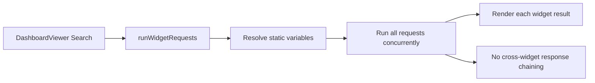
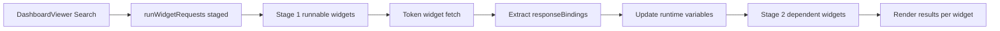

# Auto Token Chaining For Widget Headers Implementation Plan

> **For agentic workers:** REQUIRED SUB-SKILL: Use superpowers:subagent-driven-development (recommended) or superpowers:executing-plans to implement this plan task-by-task. Steps use checkbox (`- [ ]`) syntax for tracking.

**Goal:** Automatically capture an auth token from one widget response and inject it into later widget request headers in the same Search/Refresh run.

**Architecture:** Keep the current frontend-only request orchestration, but add an optional response-binding contract on REST widget data sources. `runWidgetRequests` will move from single-pass concurrent execution to staged execution: run widgets whose required variables are available, extract new runtime variables from successful responses, then run dependent widgets. No backend API contract changes are required because widget `dataSource` remains JSON payload pass-through.

**Tech Stack:** React 19, TypeScript 5, Vitest 4, existing widget runner + dashboard viewer flow.

---

## Deliverable Gate

- Audience: Engineering
- Output mode: Plan + artifact
- Artifact paths:
  - `docs/superpowers/plans/2026-06-22-auto-token-chain-widget-headers.md`
  - `docs/superpowers/plans/2026-06-22-auto-token-chain-widget-headers.html`
- Scope check: Single subsystem (frontend widget request orchestration + docs). No split required.

## Constraints Manifest

- Types and inputs:
  - Support both REST shapes already in product: `SelectedRestDataSource` (`kind: "rest"`) and `LegacyRestDataSource` (`type: "rest"`).
  - Add optional response bindings only for REST sources:
    - `responseBindings: Array<{ variable: string; jsonPath: string }>`
- Validation and runtime rules:
  - `variable` must match existing variable token format (`[A-Za-z0-9_.-]+`).
  - `jsonPath` must be a simple dot path with optional array indices (YAGNI: no full JSONPath engine).
  - Bindings apply only when widget fetch result is `ok: true`.
  - If extraction fails, variable is not set; dependent widgets remain blocked.
- Compatibility:
  - Existing dashboards with no `responseBindings` continue current behavior.
  - Existing variable replacement (`{{name}}`, typed suffixes) must remain unchanged.
- Security:
  - Token values remain in-memory runtime variables only; no implicit persistence to dashboard `variableState`.
  - Do not log extracted secret/token values.

## As-Is Diagram



## To-Be Diagram



## File Structure

- Modify: `src/main/frontend/src/widget/types.ts`
- Modify: `src/main/frontend/src/widget/widgetRequestRunner.ts`
- Modify: `src/main/frontend/src/widget/__tests__/widgetRequestRunner.test.ts`
- Modify: `src/main/frontend/src/widget/__tests__/DashboardViewer.test.tsx`
- Modify: `docs/create-guide.md`
- Modify: `docs/server-availability-dashboard.import.json`

### Task 1: Add Type Contract For Response Bindings

**Files:**
- Modify: `src/main/frontend/src/widget/types.ts`
- Test: `src/main/frontend/src/widget/__tests__/widgetRequestRunner.test.ts`

- [ ] **Step 1: Write the failing test for bound-variable extraction contract**

```ts
it("extracts token variable from responseBindings and uses it for dependent widget headers", async () => {
  const fetchWidgetData = vi
    .fn()
    .mockResolvedValueOnce({ ok: true, data: { access_token: "tok_123" } })
    .mockResolvedValueOnce({ ok: true, data: { status: "up" } });

  await runWidgetRequests({
    dashboardId: "dashboard-1",
    widgets: [tokenWidget, downstreamWidget],
    fetchWidgetData,
  });

  expect(fetchWidgetData).toHaveBeenNthCalledWith(
    2,
    "dashboard-1",
    "widget-services",
    expect.objectContaining({
      headers: expect.objectContaining({ Authorization: "Bearer tok_123" }),
    })
  );
});
```

- [ ] **Step 2: Run the focused frontend test to verify failure**

Run: `cd src/main/frontend && npm run test:run -- src/widget/__tests__/widgetRequestRunner.test.ts`
Expected: FAIL with missing `responseBindings` type support and/or no staged chaining

- [ ] **Step 3: Implement minimal type additions**

```ts
export interface ResponseBinding {
  variable: string;
  jsonPath: string;
}

export interface LegacyRestDataSource {
  type: 'rest';
  url: string;
  method: 'GET' | 'POST';
  headers: Record<string, string>;
  body: string | null;
  responseBindings?: ResponseBinding[];
}

export interface SelectedRestDataSource {
  kind: 'rest';
  dataSourceId: string;
  request: WidgetRestRequest;
  responseBindings?: ResponseBinding[];
}
```

- [ ] **Step 4: Re-run the focused test**

Run: `cd src/main/frontend && npm run test:run -- src/widget/__tests__/widgetRequestRunner.test.ts`
Expected: FAIL moved forward to runner behavior (types compile)

- [ ] **Step 5: Commit**

```bash
git add src/main/frontend/src/widget/types.ts src/main/frontend/src/widget/__tests__/widgetRequestRunner.test.ts
git commit -m "feat(widget): add response binding type contract"
```

### Task 2: Implement Staged Runner With Runtime Variable Chaining

**Files:**
- Modify: `src/main/frontend/src/widget/widgetRequestRunner.ts`
- Test: `src/main/frontend/src/widget/__tests__/widgetRequestRunner.test.ts`

- [ ] **Step 1: Add failing tests for staged execution and blocked dependents**

```ts
it("runs token provider first then dependent widgets in later stage", async () => {
  const calls: string[] = [];
  const fetchWidgetData = vi.fn(async (_d, widgetId) => {
    calls.push(widgetId);
    return widgetId === "token-widget"
      ? { ok: true, data: { data: { token: "abc" } } }
      : { ok: true, data: { result: "ok" } };
  });

  await runWidgetRequests({
    dashboardId: "dashboard-1",
    widgets: [dependentWidget, tokenWidget],
    fetchWidgetData,
  });

  expect(calls).toEqual(["token-widget", "dependent-widget"]);
});
```

```ts
it("does not execute dependent widget when required token is missing", async () => {
  const fetchWidgetData = vi.fn().mockResolvedValueOnce({ ok: true, data: {} });

  const results = await runWidgetRequests({
    dashboardId: "dashboard-1",
    widgets: [tokenWidget, dependentWidget],
    fetchWidgetData,
  });

  expect(fetchWidgetData).toHaveBeenCalledTimes(1);
  expect(results["dependent-widget"]).toEqual({ ok: false, status: 424 });
});
```

- [ ] **Step 2: Run focused tests to verify failure**

Run: `cd src/main/frontend && npm run test:run -- src/widget/__tests__/widgetRequestRunner.test.ts`
Expected: FAIL because runner is currently one-pass concurrent without response extraction

- [ ] **Step 3: Implement staged orchestration and extraction helpers**

```ts
export async function runWidgetRequests(input: RunWidgetRequestsInput): Promise<Record<string, WidgetFetchResult>> {
  const runtimeVariables = { ...(input.variables ?? {}) };
  const pending = input.widgets.filter((widget) => widget.dataSource);
  const results: Record<string, WidgetFetchResult> = {};

  while (pending.length > 0) {
    const runnable = pending.filter((widget) => canResolveWidget(widget, runtimeVariables));
    if (runnable.length === 0) {
      for (const blocked of pending) {
        results[blocked.id] = { ok: false, status: 424 };
        input.onWidgetResult?.(blocked.id, results[blocked.id]);
      }
      break;
    }

    await Promise.all(runnable.map(async (widget) => {
      const resolved = resolveDataSourceVariables(widget.dataSource, runtimeVariables);
      const result = await input.fetchWidgetData?.(input.dashboardId, widget.id, resolved ?? undefined)
        ?? await defaultFetchWidgetData(input.dashboardId, widget.id, resolved ?? undefined);

      results[widget.id] = result;
      input.onWidgetResult?.(widget.id, result);

      if (result.ok) {
        applyResponseBindings(widget.dataSource, result.data, runtimeVariables);
      }

      pending.splice(pending.findIndex((candidate) => candidate.id === widget.id), 1);
    }));
  }

  return results;
}
```

```ts
function applyResponseBindings(dataSource: Widget["dataSource"], data: unknown, vars: Record<string, string>) {
  if (!isRestSourceWithBindings(dataSource)) return;
  for (const binding of dataSource.responseBindings ?? []) {
    const value = readJsonPath(data, binding.jsonPath);
    if (typeof value === "string" && value.length > 0) {
      vars[binding.variable] = value;
    }
  }
}
```

- [ ] **Step 4: Re-run focused runner tests**

Run: `cd src/main/frontend && npm run test:run -- src/widget/__tests__/widgetRequestRunner.test.ts`
Expected: PASS, including existing dedupe/variable tests

- [ ] **Step 5: Commit**

```bash
git add src/main/frontend/src/widget/widgetRequestRunner.ts src/main/frontend/src/widget/__tests__/widgetRequestRunner.test.ts
git commit -m "feat(widget): chain runtime variables from widget responses"
```

### Task 3: Add Viewer-Level Integration Test Coverage

**Files:**
- Modify: `src/main/frontend/src/widget/__tests__/DashboardViewer.test.tsx`

- [ ] **Step 1: Write failing integration test for token-chain search flow**

```ts
it("uses token widget response to authorize downstream widget request in one Search click", async () => {
  const user = userEvent.setup();
  fetchMock.mockResolvedValueOnce(jsonResponse(dashboard));
  fetchMock.mockResolvedValueOnce(jsonResponse([tokenWidget, protectedWidget]));
  fetchMock.mockResolvedValueOnce(jsonResponse({ ...dashboard, variableState: {}, version: 5 }));
  fetchMock.mockResolvedValueOnce(jsonResponse({ access_token: "tok_999" }));
  fetchMock.mockResolvedValueOnce(jsonResponse({ status: "up" }));

  renderViewer();
  await screen.findByRole("heading", { name: "Token API" });
  await user.click(screen.getByRole("button", { name: "Search" }));

  expect(fetchMock).toHaveBeenNthCalledWith(
    5,
    "/api/dashboards/dashboard-1/widgets/widget-services/fetch",
    expect.objectContaining({
      body: expect.stringContaining("Bearer tok_999")
    })
  );
});
```

- [ ] **Step 2: Run focused viewer test to verify failure**

Run: `cd src/main/frontend && npm run test:run -- src/widget/__tests__/DashboardViewer.test.tsx`
Expected: FAIL because downstream widget still sends unresolved `{{auth_token}}`

- [ ] **Step 3: Keep DashboardViewer wiring unchanged and adapt fixtures only**

```ts
const tokenWidget = {
  id: "widget-token",
  title: "Token API",
  type: "raw_json",
  x: 0, y: 0, w: 6, h: 3,
  displayConfig: null,
  dataSource: {
    type: "rest",
    url: "https://auth.example.test/token",
    method: "POST",
    headers: { "Content-Type": "application/json" },
    body: "{}",
    responseBindings: [{ variable: "auth_token", jsonPath: "access_token" }]
  }
};
```

- [ ] **Step 4: Re-run focused viewer tests**

Run: `cd src/main/frontend && npm run test:run -- src/widget/__tests__/DashboardViewer.test.tsx`
Expected: PASS for new chained-token scenario and existing viewer behavior

- [ ] **Step 5: Commit**

```bash
git add src/main/frontend/src/widget/__tests__/DashboardViewer.test.tsx
git commit -m "test(widget): cover token response chaining in dashboard viewer"
```

### Task 4: Update Guide And Sample Dashboard Config

**Files:**
- Modify: `docs/create-guide.md`
- Modify: `docs/server-availability-dashboard.import.json`

- [ ] **Step 1: Add failing documentation consistency check in review step**

```text
Manual check target:
- create-guide includes responseBindings contract and token chain example
- sample import sets Token widget responseBindings -> auth_token
```

- [ ] **Step 2: Run local verification commands before docs edit**

Run: `cd src/main/frontend && npm run test:run -- src/widget/__tests__/widgetRequestRunner.test.ts src/widget/__tests__/DashboardViewer.test.tsx`
Expected: PASS (code complete before doc update)

- [ ] **Step 3: Update docs and sample config with concrete chain payload**

```json
"responseBindings": [
  { "variable": "auth_token", "jsonPath": "access_token" }
]
```

```json
"Authorization": "Bearer {{auth_token}}"
```

- [ ] **Step 4: Re-run tests and quick build guard**

Run: `cd src/main/frontend && npm run test:run -- src/widget/__tests__/widgetRequestRunner.test.ts src/widget/__tests__/DashboardViewer.test.tsx`
Expected: PASS

Run: `cd src/main/frontend && npm run build`
Expected: build succeeds (`tsc -b && vite build`)

- [ ] **Step 5: Commit**

```bash
git add docs/create-guide.md docs/server-availability-dashboard.import.json
git commit -m "docs(widget): document response binding token chaining"
```

## Acceptance Criteria

- One Search click can execute token widget first and then execute dependent widgets with resolved `Authorization` header.
- Existing dashboards without `responseBindings` behave as before.
- Blocked dependents are surfaced deterministically (`status: 424`) instead of hanging or sending unresolved placeholders.
- `widgetRequestRunner` and `DashboardViewer` test suites pass.
- Updated guide and sample import show an end-to-end token chaining example.

## Risks And Rollout

- Risk: Stage execution can increase total request time for dependent chains.
  - Mitigation: Keep concurrency within each stage and preserve dedupe behavior.
- Risk: Incorrect `jsonPath` silently prevents token extraction.
  - Mitigation: Document path format clearly and add unit tests for extraction behavior.
- Risk: Introducing `424` into UI state could alter rendering text.
  - Mitigation: Confirm existing renderer behavior for non-200 statuses in tests.

Rollout:
1. Ship behind data contract that is optional (`responseBindings` absent = old behavior).
2. Migrate only token-producing widgets in selected dashboards first.
3. Monitor widget fetch failures after release, then expand usage.

## Self-Review

- Spec coverage: Captures token response and automatically reuses it in downstream headers with no manual variable copy.
- Placeholder scan: No TBD/TODO placeholders; all tasks include concrete files, snippets, commands, expected outcomes.
- Type consistency: `responseBindings`, `variable`, `jsonPath`, and runtime `auth_token` names are consistent across tasks.

## Execution Handoff

Plan complete and saved to `docs/superpowers/plans/2026-06-22-auto-token-chain-widget-headers.md`. Two execution options:

**1. Subagent-Driven (recommended)** - I dispatch a fresh subagent per task, review between tasks, fast iteration

**2. Inline Execution** - Execute tasks in this session using executing-plans, batch execution with checkpoints

Which approach?
