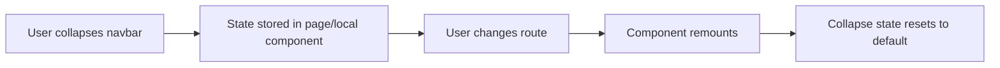
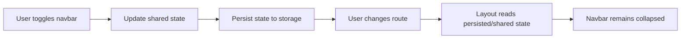

# Navbar Collapse Persistence Plan

## Goal
Keep the navbar collapsed state when users navigate between pages.

## As-Is

## To-Be

## Scope
- Persist sidebar/nav collapse preference across route changes.
- Keep behavior consistent on browser refresh.
- Avoid changing visual design or menu items.

## Implementation Steps
1. Find the single source of truth for navbar collapse state in layout/navigation components.
2. Move collapse state to app-level scope (layout provider/global store) if currently page-local.
3. Add storage sync for collapse state (`localStorage` key such as `ui.nav.collapsed`).
4. On app/layout init, read stored value and initialize collapse state.
5. On toggle, update both in-memory state and persisted value.
6. Ensure route transitions do not reinitialize state unexpectedly.

## Validation Checklist
- Collapse navbar on Page A, navigate to Page B: still collapsed.
- Expand navbar on Page B, navigate to Page C: remains expanded.
- Refresh browser after collapse: state remains collapsed.
- Refresh browser after expand: state remains expanded.
- Verify no layout flicker during first render.

## Risks and Mitigations
- Risk: Hydration/first-render flicker.
  - Mitigation: Initialize state synchronously before first paint where possible.
- Risk: Multiple components writing different collapse values.
  - Mitigation: Centralize write path in one toggle handler.

## Definition of Done
- Navbar collapse state is stable across internal navigation.
- State remains correct across reloads.
- Existing navigation behavior and tests continue to pass.
