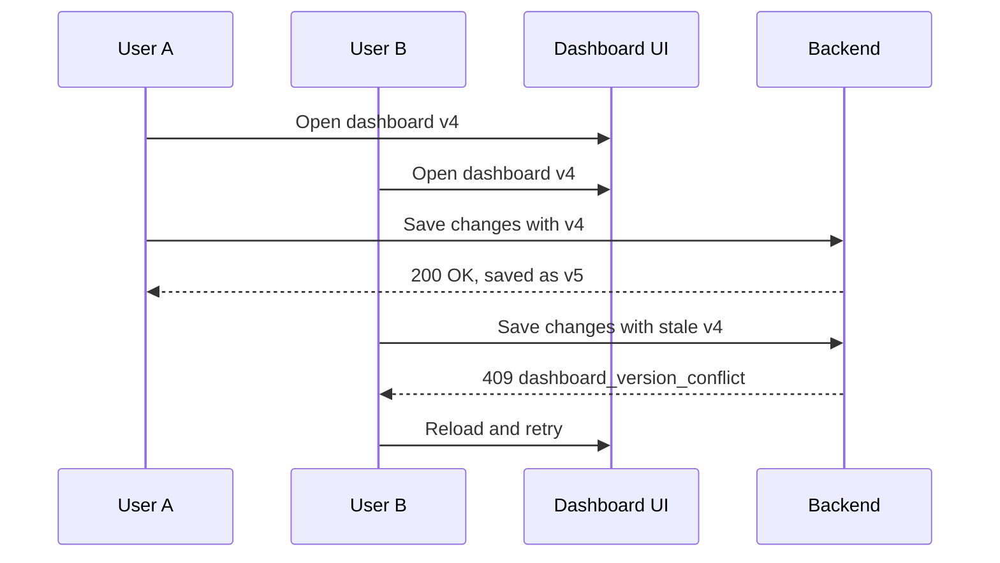

# Dashboard edit race

```mermaid
sequenceDiagram
  participant A as User A
  participant B as User B
  participant UI as Dashboard UI
  participant API as Backend

  A->>UI: Open dashboard v4
  B->>UI: Open dashboard v4
  A->>API: Save changes with v4
  API-->>A: 200 OK, saved as v5
  B->>API: Save changes with stale v4
  API-->>B: 409 dashboard_version_conflict
  B->>UI: Reload and retry
```
