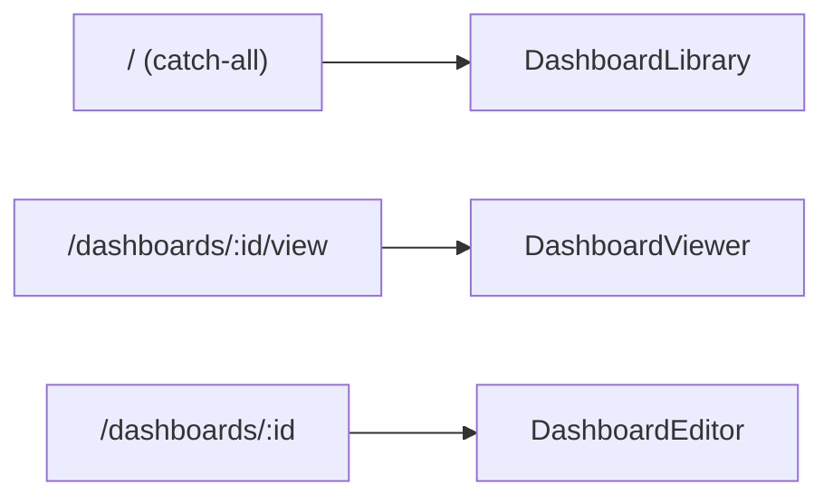
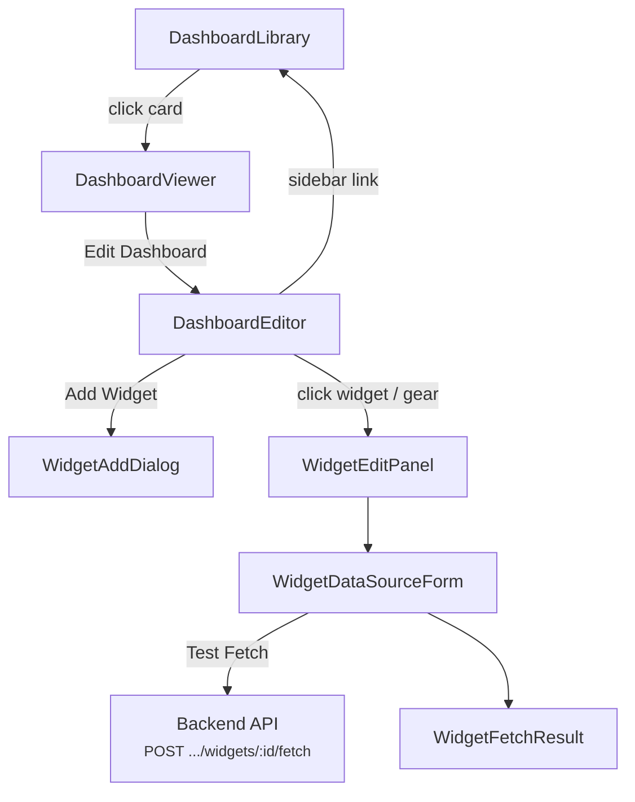

# Dashboard Editor Workflow

## Route Map



## Navigation Flow



## Step-by-Step Workflow

### 1. Dashboard Library (`/`)
- Fetches `GET /api/dashboards` → renders `DashboardCard` grid
- Supports search (client-side filter on name + description)
- Dialogs: Create, Rename, Delete (with version-conflict handling)
- **Duplicate** uses `POST /api/dashboards/:id/duplicate` (no version check, fresh version=1 for copy)
- Clicking a card navigates to `/dashboards/:id/view`

### 2. Dashboard Viewer (`/dashboards/:id/view`)
- Fetches `GET /api/dashboards/:id` + `GET /api/dashboards/:id/widgets` (parallel)
- Renders widgets in a 12-column CSS grid via `WidgetRenderer` — **read-only, no interaction**
- Title bar with "Edit Dashboard" link → `/dashboards/:id`
- Widgets are pure display: no drag, no gear/delete buttons, no add button

### 3. Dashboard Editor (`/dashboards/:id`)
- Fetches `GET /api/dashboards/:id` + `GET /api/dashboards/:id/widgets` (parallel)
- Renders widgets in the same 12-column grid, but fully interactive:

#### Widget interactions
| Action | Mechanism | API Call |
|---|---|---|
| **Drag to reposition** | Pointer events (`onPointerDown/Move/Up`) with grid-snapped delta calculation | `PATCH .../widgets/:id?dashboardVersion=N` (new x,y) |
| **Click / gear icon** | Opens `WidgetEditPanel` slide-in for that widget | — |
| **Delete (× button)** | `window.confirm` → calls remove API | `DELETE .../widgets/:id?dashboardVersion=N` |
| **Add Widget** | `WidgetAddDialog` with auto-position (first-fit packing) | `POST .../widgets?dashboardVersion=N` |

#### Header actions
- "View" link → `/dashboards/:id/view`
- "Add Widget" button → opens `WidgetAddDialog`
- "Dashboard Library" sidebar link → `/`

### 4. Widget Add Dialog
- Fields: Title (required), Type (select: table/chart/metric/text), Position (X, Y), Size (Width, Height)
- Default position auto-calculated via `findDefaultPosition()` — scans the 12-column grid for the first free cell using a first-fit packing algorithm
- On submit → `POST .../widgets?dashboardVersion=N` → appends to local `widgets[]` state

### 5. Widget Edit Panel (slide-in)
- Opened by clicking a widget card or its gear icon
- Fields: Title, Type, X, Y, Width, Height
- **Data Source section** (`WidgetDataSourceForm`):
  - URL, Method (GET/POST), Headers (add/remove key-value pairs), Body (shown for POST)
  - "Test Fetch" button → `POST .../widgets/:id/fetch` with current form values as body
  - Result displayed via `WidgetFetchResult` (error box or pretty-printed JSON)
  - ⚠️ Data source form values are **local state only** — not saved to widget on submit
- On "Save" → `PATCH .../widgets/:id?dashboardVersion=N` → updates `widgets[]` and closes panel

## Data Model

### Dashboard (Java `record`, stored in `dashboards` SQLite table)
| Field | Type | Notes |
|---|---|---|
| `id` | UUID | Primary key |
| `name` | String | |
| `description` | String | |
| `widgetsJson` | String | JSON array of all widgets, serialized |
| `version` | long | Optimistic lock, incremented on every write |
| `createdAt` | Instant | |
| `updatedAt` | Instant | |

### Widget (Java `record`, embedded JSON in `dashboards.widgetsJson`)
| Field | Type | Notes |
|---|---|---|
| `id` | UUID | |
| `title` | String | |
| `type` | enum | `table`, `chart`, `metric`, `text` |
| `x`, `y` | int | Grid position (0-indexed, 12 columns) |
| `w`, `h` | int | Size in grid units |
| `displayConfigJson` | String | Arbitrary widget-type-specific JSON |
| `dataSourceJson` | String | REST data source config JSON |

### Frontend types
```typescript
interface Widget {
  id: string;  title: string;  type: WidgetType;
  x: number;  y: number;  w: number;  h: number;
  displayConfig: Record<string,unknown> | null;
  dataSource: DataSource | null;
}
interface DataSource {
  type: "rest";
  url: string;
  method: "GET" | "POST";
  headers: Record<string,string>;
  body: string | null;
}
```

## API Endpoints

### Dashboards (`/api/dashboards`)
| Method | Path | Purpose | Version check |
|---|---|---|---|
| `GET` | `/` | List all (ordered by `updated_at DESC`) | No |
| `GET` | `/:id` | Get single dashboard (+ parsed widgets) | No |
| `POST` | `/` | Create | No |
| `PATCH` | `/:id` | Rename (name, description, version) | Yes |
| `POST` | `/:id/duplicate` | Duplicate with " Copy" suffix | No |
| `DELETE` | `/:id?version=N` | Delete | Yes (query param) |

### Widgets (`/api/dashboards/:dashboardId/widgets`)
| Method | Path | Purpose | Version param |
|---|---|---|---|
| `GET` | `/` | List all | No |
| `POST` | `/` | Add | `?dashboardVersion=N` |
| `PATCH` | `/:widgetId` | Update (title, type, position, size, config) | `?dashboardVersion=N` |
| `PUT` | `/order` | Reorder (sends `{orderedIds: [...]}`) | `?dashboardVersion=N` |
| `DELETE` | `/:widgetId` | Remove | `?dashboardVersion=N` |
| `POST` | `/:widgetId/fetch` | Test fetch (sends data source in body) | No |

## Error Handling

| HTTP Status | Code | Trigger | Frontend Behavior |
|---|---|---|---|
| 400 | `validation_error` | Bean/input validation fails | Show field errors under form inputs |
| 404 | `dashboard_not_found` | Dashboard ID not found | Error banner (load) / dialog message (mutation) |
| 404 | `widget_not_found` | Widget ID not found within dashboard | Error banner |
| 409 | `dashboard_version_conflict` | Version mismatch (concurrent edit) | Conflict banner with "Reload" link |
| 500 | `internal_error` | Unexpected runtime exception | Error banner |

All widget mutations (add, update, delete, reorder) send the `dashboardVersion` captured at load time. If it doesn't match the DB version, the SQL `UPDATE ... WHERE version = ?` updates 0 rows, and the backend throws 409. The frontend shows a reload link to re-fetch with the fresh version.

## Widget Renderers

| Type | Display | Config |
|---|---|---|
| `table` | `<table>` with column headers from `displayConfig.columns` | `columns: string[]` |
| `chart` | Inline SVG sparkline (hardcoded sample data) | — |
| `metric` | Large centered number | `value: string` |
| `text` | `<pre>` block | `content: string` |

All renderers are shared between Viewer and Editor via `WidgetRenderer.tsx`.

## Serialization Detail

The frontend `widgetApi.ts` handles conversion between the API wire format and the typed `Widget` interface:

```
Wire format (JSON)         Frontend Widget
─────────────────          ───────────────
displayConfigJson  ──parse──→  displayConfig (object)
displayConfig      ←direct──  displayConfig (object)
dataSourceJson     ──parse──→  dataSource (object)
dataSource         ←direct──  dataSource (object)
```

The `normalizeWidget()` and `widgetRequest()` functions in `widgetApi.ts` handle both `*Json` (string) and direct object formats for backward compatibility.
